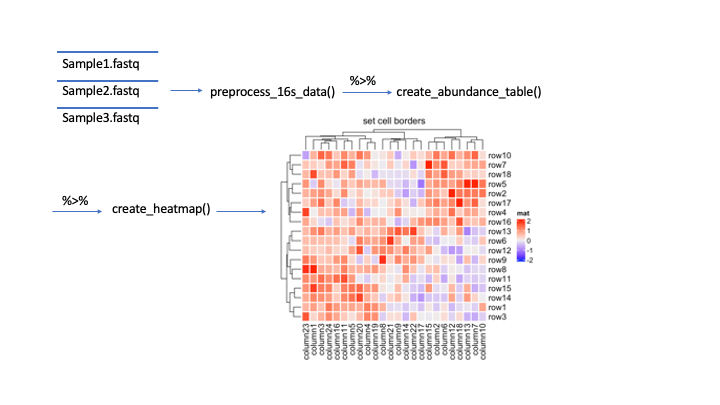

<!-- README.md is generated from README.Rmd. Please edit that file -->

```{r, include = FALSE}
knitr::opts_chunk$set(
  collapse = TRUE,
  comment = "#>",
  fig.path = "man/figures/README-",
  out.width = "100%"
)
```

# CompHeatmaps

<!-- badges: start -->
A large problem in conducting metatranscriptomic analysis on microbial communities is dealing with the complexity
of the large amount of data we are working with. Heatmaps are a useful visualization that illustrate the abundance
across these samples at a glance. However, getting from raw sequence reads to heatmaps is quite a cumbersome process.

The goal of CompHeatmaps is to simplify this complex process by generating heatmaps as easy as 1, 2, 3.

This package was created in R version 4.3.1
<!-- badges: end -->

## Installation

You can install the development version of CompHeatmaps from [GitHub](https://github.com/kojiwong/CompHeatmaps) with:
``` r
# install.packages("devtools")
# library("devtools)
devtools::install_github("kojiwong/CompHeatmaps")
library("CompHeatmaps")
```


## Overview

The main components of this R package include the functions
`preprocess_16s_data`, `create_abundance_table`, and `create_heatmap`

The image below illustrates what the inputs and the outputs of the package
functions are at a glance.



```
ls("package:CompHeatmaps")
data(package = "CompHeatmaps")
browseVignettes("CompHeatmaps")
```
    
CompHeatmaps contains 3 functions.
  1. *preprocess_16s_data* which preprocesses raw 16S rRNA using dada2
  2. *create_abundance_table* which creates an abundance table from our preprocessed data
  3. *create_heatmap* which creates a heatmap from our abundance table
  
The package also contains some sample data acquired from the Human Microbiome Project (HMP).

## Contributions
The author of this package is Koji Wong. The author wrote the 
`preprocess_16s_data` and `create_abundance_table` functions which utilizes the 
dada2 package to preprocess 16S rRNA data and formats it in an abundance table 
which can be utilized for the other function this author created 
`create_heatmap`, which utilizes the heatmap.2 function from the gplots package.

This package heavily depends on the metatranscriptomic pipeline dada2 for
data preprocessing and creation of abundance matrices. This package also 
utilizes gplot to create heatmap illustrations of abundances.

## References 

- A framework for human microbiome research. Human Microbiome Project Consortium, Nature, 486 (2012), pp. 215-221.

- Structure, function and diversity of the healthy human microbiome. Human Microbiome Project Consortium, Nature, 486   (2012), pp. 207–214.

- Warnes G, Bolker B, Bonebakker L, Gentleman R, Huber W, Liaw A, Lumley T, Maechler M, Magnusson A,
  Moeller S, Schwartz M, Venables B (2022). _gplots: Various R Programming Tools for Plotting Data_. R
  package version 3.1.3, <https://CRAN.R-project.org/package=gplots>.

- Callahan BJ, McMurdie PJ, Rosen MJ, Han AW, Johnson AJA, Holmes SP (2016). “DADA2: High-resolution sample
  inference from Illumina amplicon data.” _Nature Methods_, *13*, 581-583. doi:10.1038/nmeth.3869
  <https://doi.org/10.1038/nmeth.3869>.


## Acknowledgements
This package was developed as part of an assessment for the BCB410H class taken
in Fall 2023 with Professor Anjali Silva at the University of Toronto, Toronto,
Canada. `CompHeatmaps` welcomes any suggestions, issues, and contributions to
this package.

## Future Improvements
Currently this package produces a heatmap illustrating abundance of sequence 
reads across the samples after filtering, which is not so interesting as opposed 
to taxons. As a result, much of the heatmap will consist of neutral abundance
representation. 

To improve on this for the future, one goal of the package can
be to perform taxonomic classification on the sequence table and some how
incorporate this into heatmap creation rather than sequence variants.


