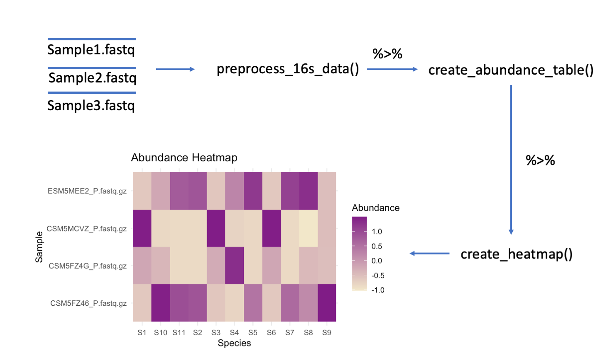

<!-- README.md is generated from README.Rmd. Please edit that file -->

# CompHeatmaps

<!-- badges: start -->

## Description

A large problem in conducting metatranscriptomic analysis on microbial
communities is dealing with the complexity of the large amount of data
researchers tend to work with. Heatmaps are a useful visualization that
illustrate the abundance across these samples at a glance. However,
going from raw sequence reads to heatmaps is quite a cumbersome process.

The goal of CompHeatmaps is to simplify this complex process by easily
generating heatmaps from raw 16S sequence variants.

This package was created in R version 4.3.1 on Mac platform with macOS
version Sonoma 14.1 <!-- badges: end -->

## Installation

You can install the development version of CompHeatmaps from
[GitHub](https://github.com/kojiwong/CompHeatmaps) with:

``` r
install.packages("devtools")
library("devtools")
devtools::install_github("kojiwong/CompHeatmaps", build_vignettes = TRUE)
library("CompHeatmaps")
```

To run the Shiny app:

``` r
CompHeatmaps::runCompHeatmaps()
```

## Overview

The main components of this R package include the functions
`preprocess_16s_data`, `create_abundance_table`, and `create_heatmap`.
These functions are meant to be run in the specified listed order.

The image below illustrates what the inputs and the outputs of the
package functions are at a glance.



The heatmap below is produced after `create_heatmap()` following the
examples. 

    ls("package:CompHeatmaps")
    browseVignettes("CompHeatmaps")

CompHeatmaps contains 3 functions: - `preprocess_16s_data`: This
function takes in a directory of raw sequence reads of a sample in fastq
file, one file per sample and an output directory where filtered results
will be outputted to. In addition, it can take a `verbose` bool to print
updates of preprocessing and a `multithread` bool if you wish to use
multithreading. This function returns a list of a filtered dada objects
which we can pass into `create_abundance_table`.

- `create_abundance_table`: This function takes in a list of dada
  objects to create an abundance table from preprocessed 16S data. You
  may also pass a `multithread` bool to process large amounts of data
  quicker. This function outputs a normalized and scaled matrix of
  relative abundance of sequence variants between samples.

- `create_heatmap`: This function takes in two inputs. The first is the
  abundance matrix we generated in `create_abundance_table` that we wish
  to visualize. The second parameter is `proportion`, a number between 0
  and 1 which dictates the proportion of the abundance table we wish to
  visualize. By default, `proportion` is set to 1 which will visualize
  relative abundance of all the sequence variants. Ths function returns
  a ggplot2 heatmap.

The package also contains some sample data acquired from the Human
Microbiome Project (HMP). This data is located in the directory
“inst/extdata/sample_raw_16S_data” of this package.

## Contributions

The author of this package is Koji Wong. The author wrote the
`preprocess_16s_data` and `create_abundance_table` functions which
utilizes the dada2 package to preprocess 16S rRNA data and formats it in
an abundance table which can be utilized for the other function this
author created `create_heatmap`, which calls the ggplot2 package for
visualization.

This package heavily depends on the metatranscriptomic pipeline dada2
for data preprocessing and creation of abundance matrices. This package
also utilizes ggplot2 to create heatmap illustrations of sequence
variant abundances.

This package also makes use of ggplot2 to create heatmaps, as well as
packages tibble and tidyr to clean up the table for ggplot2 input.

## References

- A framework for human microbiome research. Human Microbiome Project
  Consortium, *Nature*, 486 (2012), pp. 215-221.

- Structure, function and diversity of the healthy human microbiome.
  Human Microbiome Project Consortium, *Nature*, 486 (2012),
  pp. 207–214.

- Callahan BJ, McMurdie PJ, Rosen MJ, Han AW, Johnson AJA, Holmes SP
  (2016). “DADA2: High-resolution sample inference from Illumina
  amplicon data.” *Nature Methods*, *13*, 581-583.
  <doi:10.1038/nmeth.3869> <https://doi.org/10.1038/nmeth.3869>.

- Alexander Lex, Nils Gehlenborg, Hendrik Strobelt, Romain Vuillemot,
  Hanspeter Pfister, UpSet: Visualization of Intersecting Sets, IEEE
  Transactions on Visualization and Computer Graphics (*InfoVis* ’14),
  vol. 20, no. 12, pp. 1983–1992, 2014.

- Wickham H, Hester J, Chang W, Bryan J (2022). *devtools: Tools to Make
  Developing R Packages Easier*. R package version 2.4.5,
  <https://CRAN.R-project.org/package=devtools>.

- H. Wickham. ggplot2: Elegant Graphics for Data Analysis.
  Springer-Verlag New York, 2016.

- Müller K, Wickham H (2023). *tibble: Simple Data Frames*. R package
  version 3.2.1, <https://CRAN.R-project.org/package=tibble>.

- Wickham H, Vaughan D, Girlich M (2023). *tidyr: Tidy Messy Data*. R
  package version 1.3.0, <https://CRAN.R-project.org/package=tidyr>.

- Chang W, Cheng J, Allaire J, Sievert C, Schloerke B, Xie Y, Allen J,
  McPherson J, Dipert A, Borges B (2023). *shiny: Web Application
  Framework for R*. R package version 1.8.0,
  <https://CRAN.R-project.org/package=shiny>.

## Acknowledgements

This package was developed as part of an assessment for the BCB410H
class taken in Fall 2023 with Professor Anjali Silva at the University
of Toronto, Toronto, Canada. `CompHeatmaps` welcomes any suggestions,
issues, and contributions to this package.

## Future Improvements

Currently this package produces a heatmap illustrating abundance of
sequence reads across the samples after filtering, which is not so
interesting as opposed to taxons. As a result, much of the heatmap will
consist of neutral abundance representation.

To improve on this for the future, one goal of the package can be to
perform taxonomic classification on the sequence table and some how
incorporate this into heatmap creation rather than sequence variants.

Another improvement could be on the heatmap generation itself, by adding
placeholder names for the sequence variants rather than the DNA
sequence.
