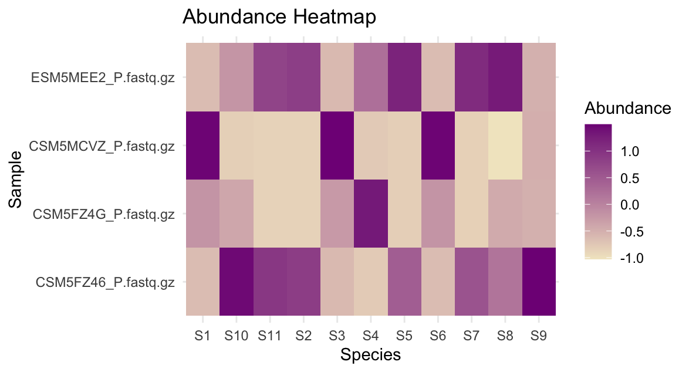

```{r, include = FALSE}
knitr::opts_chunk$set(
  collapse = TRUE,
  comment = "#>"
)
```

## Introduction
`CompHeatmaps` is an R package developed to assist in initial metatranscriptomic investigation of microbial communities. This package utilizes the dada2 package from Bioconductor to preprocess sequence variants of the highly conserved but variable 16S rRNA V4 region of bacteria, which acts as a barcode to associated with the bacterial species.

To download **CompHeatmaps** use the following commands:
``` r
require("devtools")
devtools::install_github("kojiwong/CompHeatmaps", build_vignettes = TRUE)
library("CompHeatmaps")
```

## Application
Get more information on specific functions by using `?`
``` r
library("CompHeatmaps")
?CompHeatmaps::preprocess_16s_data
```

Use the sample fastq data stored in the inst/extdata/sample_raw_16S_data as input for the first preprocessing step done in `preprocess_16s_data`. Running this step will take a couple of minutes to run, we are processing millions of bacterial reads. If your CPU has multiple cores, you can try setting `multithread = TRUE` in the parameters. You may also set `verbose = TRUE` to get updates where we are in processing.
# sequencing reads
``` r
input_dir <- system.file("inst/extdata/sample_raw_16s_data", package = "CompHeatmaps")
output_dir <- system.file("inst/extdata/filtered_outputs", package = "CompHeatmaps")
# Below is what the output looks like while it is running with verbose set to TRUE. 
# Note: We can also see progress of the 4 samples being piped through dada2's `dada` function.
dada_output <- CompHeatmaps::preprocess_16s_data(input_dir, output_dir, verbose = TRUE, multithread = TRUE)
## [1] "Filtering Paired Reads in 16S Data, this may take a couple of minutes..."
## [1] "Filtering Step complete."
## [1] "Learning the Error Rates, this may take a couple of minutes..."
## 111202000 total bases in 794300 reads from 3 samples will be used for learning the error rates.
## [1] "Error Learning Step complete."
## [1] "Piping through dada, this may take a couple of minutes..."
## Sample 1 - 243193 reads in 78981 unique sequences.
## Sample 2 - 302169 reads in 117320 unique sequences.
## Sample 3 - 248938 reads in 91878 unique sequences.
## Sample 4 - 229677 reads in 77916 unique sequences.
## [1] "Preprocessing of 16S data done."
# Check the length of the output, we will have 1 dada object per sample (fastq file)
length(dada_output)
## [1] 4
```


Let's make a sequence table to analyze the abundance of our processed reads.
``` r
# Make a sequence table
seq_table <- create_abundance_table(dada_output)
rownames(seq_table) <- sample_data.names
# View the dimensions, we will have 1 row for each sample and 1 column for each unique read
dim(seq_table)
## [1]   4 432
class(seq_table)
## [1] "matrix" "array"
# We can view the scaled and normalized abundance value for each sample using matrix indexing. Here is the first column of a specific sequence variant. Positive values indicate higher relative abundance of the queried sequence variant.
seq_table[, 1]
## CSM5FZ46_P.fastq.gz CSM5FZ4G_P.fastq.gz CSM5MCVZ_P.fastq.gz ESM5MEE2_P.fastq.gz 
##           -0.632696           -0.203601            1.468992           -0.632696 
```

Finally, we can plot our data using the `create_heatmap` function. We use `proportion` to cut a slice of the heatmap for cleaner visual analysis. With `proportion = 1` (default) the heatmap will visualize relative sequence abundance across all 432 sequence variants across the 4 samples.
``` r
create_heatmap(table = seq_table, proportion = 0.025)
```
<div style="text-align:center"> </div>

## Package References
- Wong, K. (2023) CompHeatmaps: Visualization of raw 16S sequence variant abundance for metatranscriptomic analysis. Unpublished. <https://github.com/kojiwong/CompHeatmaps>
- Callahan BJ, McMurdie PJ, Rosen MJ, Han AW, Johnson AJA, Holmes SP
  (2016). DADA2: High-resolution sample inference from Illumina
  amplicon data.” *Nature Methods*, *13*, 581-583.
  <doi:10.1038/nmeth.3869> <https://doi.org/10.1038/nmeth.3869>.


## Other References

- A framework for human microbiome research. Human Microbiome Project
  Consortium, Nature, 486 (2012), pp. 215-221.

- Structure, function and diversity of the healthy human microbiome.
  Human Microbiome Project Consortium, Nature, 486 (2012), pp. 207–214.

- Warnes G, Bolker B, Bonebakker L, Gentleman R, Huber W, Liaw A, Lumley
  T, Maechler M, Magnusson A, Moeller S, Schwartz M, Venables B (2022).
  *gplots: Various R Programming Tools for Plotting Data*. R package
  version 3.1.3, <https://CRAN.R-project.org/package=gplots>.

- Alexander Lex, Nils Gehlenborg, Hendrik Strobelt, Romain Vuillemot,
  Hanspeter Pfister, UpSet: Visualization of Intersecting Sets, IEEE
  Transactions on Visualization and Computer Graphics (InfoVis ’14),
  vol. 20, no. 12, pp. 1983–1992, 2014.

- Wickham H, Hester J, Chang W, Bryan J (2022). *devtools: Tools to Make
  Developing R Packages Easier*. R package version 2.4.5,
  <https://CRAN.R-project.org/package=devtools>.

```{r}
sessionInfo()
```
